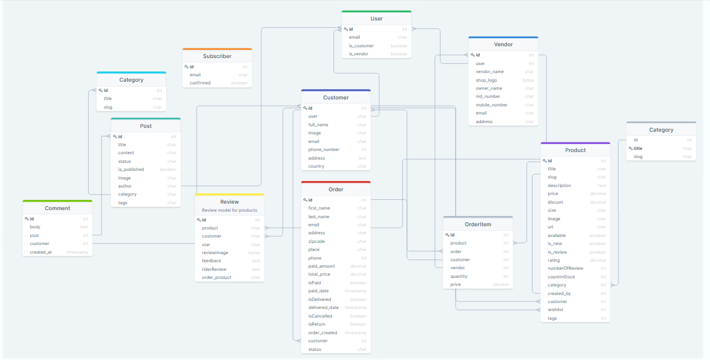

# Multi vendor e-commerce platform

A scalable advanced multi-vendor e-commerce software application with Role-Based Access Control (RBAC) feature is a sophisticated platform designed to cater to the needs of multiple vendors and users within the e-commerce ecosystem

## The Lomofy Diagram

--> *Preview :*

  

 

--> *Full View:*

You can see clearly the diagram at :&nbsp; 
## Introduction

The application is multivendor eCommerce platform with Role-based access control (RBAC) that empowers multiple vendors to sell their products from one storefront. Multivendor store gives shoppers a huge catalog to choose from and provides sellers with a bigger base of ready-to-buy customers.

## 📸 Screenshot

 

    🔎 View
 

 ### 💻 Home

### 🧾 Product Details

### ⌛ Recently Viewd

 ### 💝 Wishlist
 
 
 ### 👨🏻‍💻 Customer Profile
 

### 🛒 Order Details

### 💻 Vendor

### ✅ Vendor Sign up

### ✅ Vendor Sign In

 
 
## Table Of Contents:

- [💻 Application Overview](docs/application-overview.md)
- [⚙️ Project Configuration](docs/project-configuration.md)
- [👁️ Style Guide](docs/style-guide.md)
- [🗄️ Project Structure](docs/project-structure.md)
- [📡 API Layer](docs/api-layer.md)
- [🗃️ State Management](docs/state-management.md)
- [🧪 Testing](docs/testing.md)
- [⚠️ Error Handling](docs/error-handling.md)
- [🔐 Security](docs/security.md)
- [🌐 Deployment](docs/deployment.md)
- [📚 Additional Resources](docs/additional-resources.md)

## 🛡️ License

 Multi vendor e-commerce platform is licensed under the MIT License - see the [`LICENSE`](LICENSE) file for details.
 
 ## 🙏 Support

This project needs a ⭐️ from you. Don't forget to leave a star ⭐️

## ↳ Stargazers

<!-- Get in touch - Start -->
## Get in touch

Author:
<a href="https://www.linkedin.com/in/hossainchisty/" target="_blank">Hossain Chisty</a> 
If you would like to have my help with your team and product, feel free to contact me. 🤓
<!-- Get in touch - End -->

